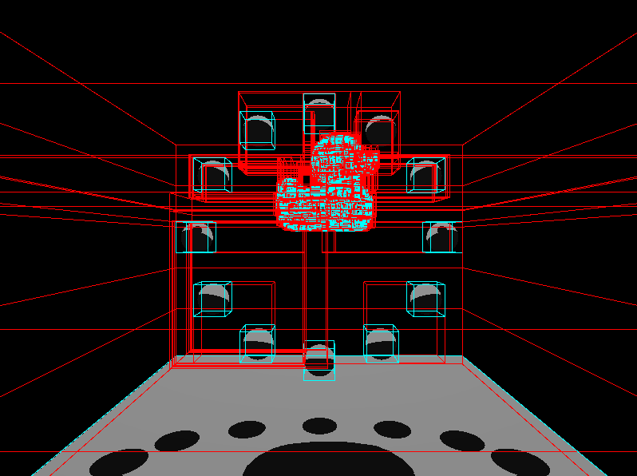
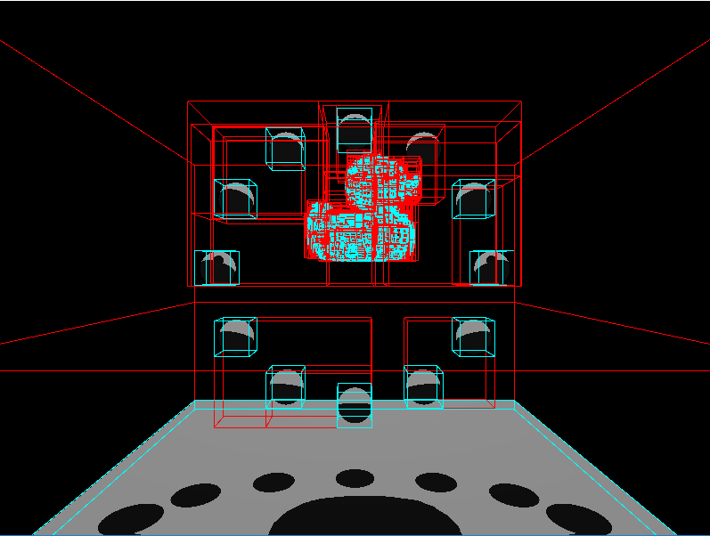
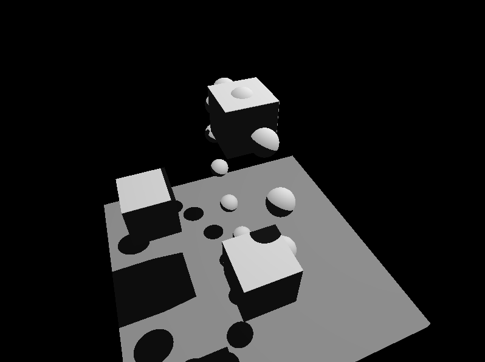
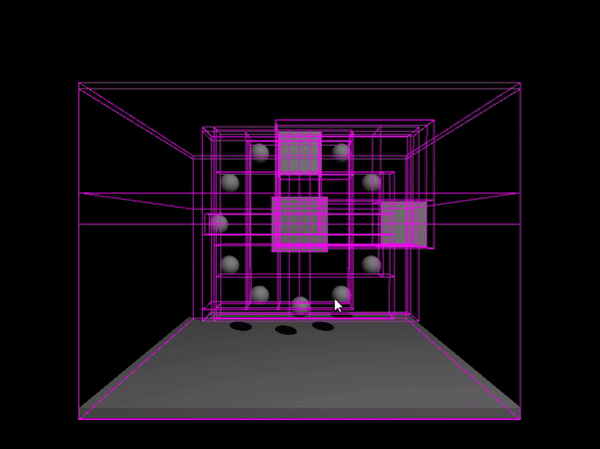
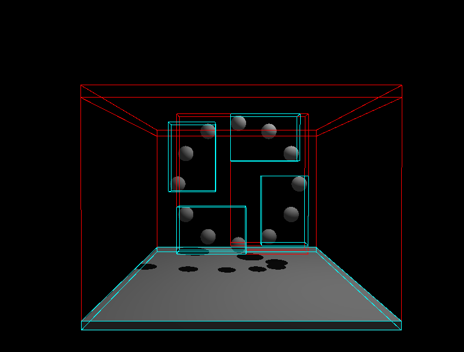
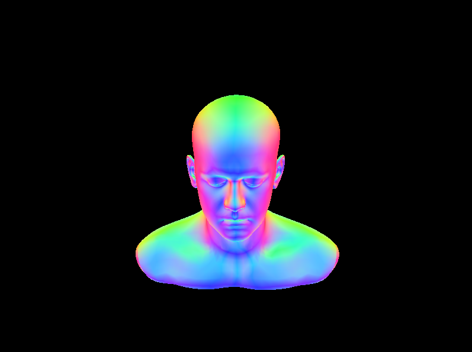
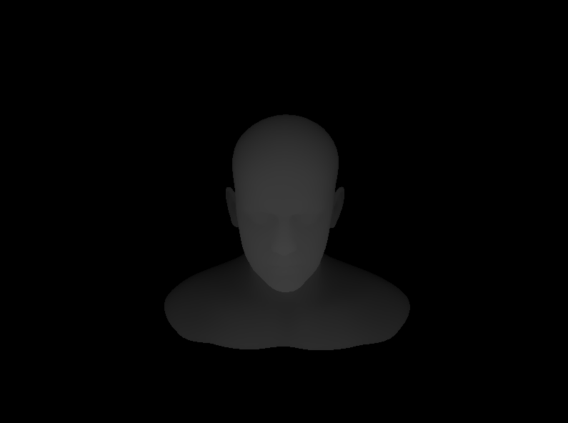
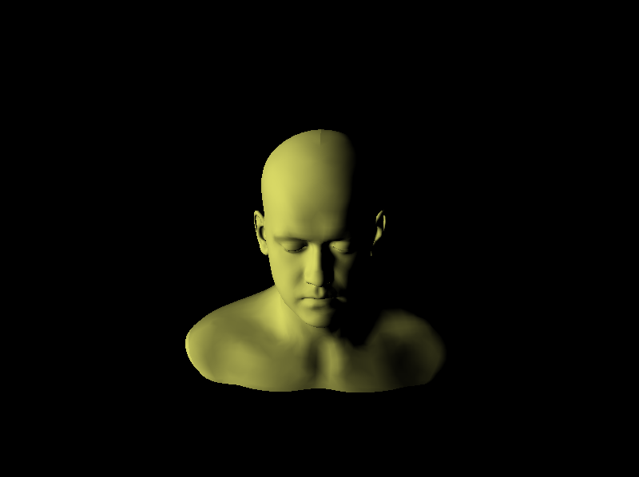
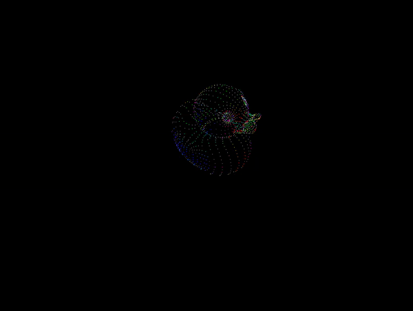
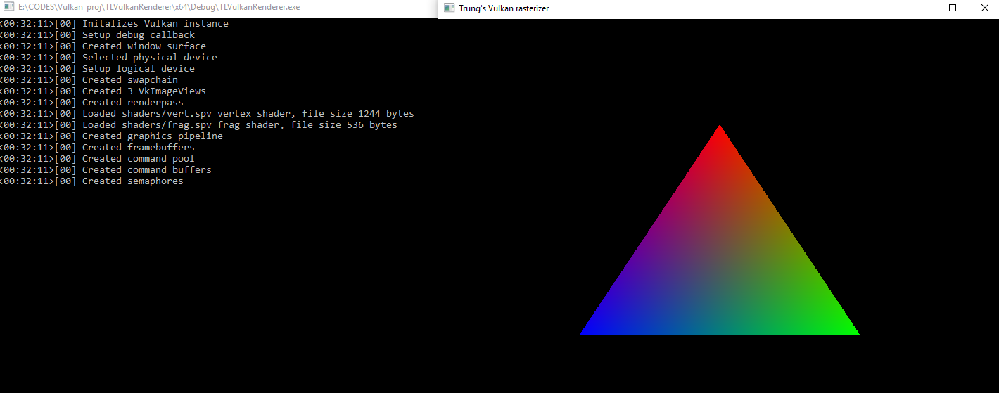

# TLVulkanRenderer
A simple Vulkan-based renderer for my [master thesis](https://docs.google.com/document/d/1YOAv2D23j74bExjP2MCMmDOQPquy9ywhBTW-tgU2QXA/edit?usp=sharing) on real-time transparency under the advise of [Patrick Cozzi](http://www.seas.upenn.edu/~pcozzi/).

The renderer will be a rasterizer the implements [phenomenological transparency](http://graphics.cs.williams.edu/papers/TransparencyI3D16/McGuire2016Transparency.pdf) by [Morgan McGuire](http://cs.williams.edu/~morgan/) to demonstrate how the GPU could map well to this algorithm for real-time transparency.

This README also documents my learning progress with Vulkan and GPU programming.

# Releases

- **[v1.1](https://github.com/trungtle/TLVulkanRenderer/releases/tag/v1.1)**, _11/30/2016_
- **[v1.0](https://github.com/trungtle/TLVulkanRenderer/releases/tag/v1.0)**, _10/30/2016_

# Updates

### Feb 4, 2017 - SAH for BVH and uniform SSAA

#### SAH for BVH

Previously, the BVH only supported splitting using the `EqualCounts` method. This method partition evenly the number of geometries for each child node of a BVH interior node. While simple to implement and easy to understand, `EqualCounts` isn't the most efficient way to construct BVH tree. So this week I implemented the Surface Area Heuristics method, or `SAH`. Ray tracing speed is constrained by the cost of ray-triangle intersection, so the more we can skip irrelevant triangles, the better. `SAH` uses the surface area of primitive's bounding box to compute to probability the ray can intersect that bounding box, and decide whether to split a BVH node at that point, or generate a leaf node. We can think of the cost of splitting a node along a plane as:

`TotalCost = C_t + C_i * numTrisA * Area(childA) / Area(parent) + C_i * numTrisB * Area(childB) / Area(parent)`, where

* C_t: cost of traversal. The assumption here is that C_t = C_i / 8 (based on pbrt)
* C_i: cost of ray-triangle intersection
* numTrisA: number of triangles in child node A
* numTrisB: number of triangles in child node B

Based on the implementation in pbrt book, I first divided the splitting plane into 12 buckets to minimize searching for all possible splitting points. The buckets look like this:


The for each bucket, I computed the cost of splitting plane versus the cost of ray-triangle intersections for all primitives in that node. If the cost of doing the intersection test is cheaper, the turn this node into a leaf node instead, otherwise, split the node in half along the minimal cost bucket's centroid.

The result of SAH does in fact increased the speed of tree traversal. For the following test scene of the glTF duck:

| Equal counts | SAH |
|---|---|
|||

the result is:

|  | Equal counts | SAH |
| --- | --- | --- |
| # Primitives | 4212 | 4212 |
| # BVH nodes  | 8449 | 8447 |
| # frames     | 300  | 300  |
| ms / frame   | 193.04 | 130.33 |

This confirms to me that in fact using `SAH` splitting method is an improvemance from using `EqualCounts` method. With the duck scene, the application was running 8-12 FPS. While a bit slow, this is a lot faster than my GPU ray tracing implementation.

#### Uniform SSAA

The ray tracer takes in a `Sampler` class that generate samples based on the pixel coordinates. For now, there is only one derived `UniformSampler`that generates X4, X8, and X6 samples. Running a SSAA sampler does reduce the performance of the ray tracer significantly. In the future, likely this will be swapped out for MSAA or TXAA to improve speed.

| No SSAA | SSAA X16 |
|---|---|
|||


#### Plan

To fully finish the acceleration structure, I still need to add spatial splitting to the BVH structure. The idea of an SBVH is to compare the cost of object splitting, the cost of spatial splitting, and the cost of generating a new leaf. This spatial splitting is similar to kd-tree, so I need to review again how kd-tree is implemented.

I also have mentioned using a queue of rays for multhreading tasks. With the queue implemented, free threads would be able to perform work instead of sitting idle. Going to also take a look of that next.

### Jan 30, 2017 - CPU ray tracer with BVH and multithreading

#### Multithreading

For this update, the CPU ray tracer now has added multithreading (using C++11 `std::thread`). Each render call will now launch up to 16 threads if available and ray trace for a 4x4 tiled image. 

For next week, I'm going to experiment with having the main thread render the next frame while the other worker threads ray trace. Addditionally, each generated ray should be put on a shared queue that each thread can pick up as soon as it has done its job instead of just sitting and waiting for all threads to join. Given the complexity differences for each pixel traced, this can give us the benefit of balancing out work load between each thread.

#### BVH



I also added a basic BVH structure to the scene. Since SBVH and BVH shares a similar structure and only differs in its construction phase, I opted to build and verified working for the normal BVH first before moving on to SBVH. The BVH currently splits along the maximum extent of the bounding box and not using SAH.

Each leaf node can contains up to several primitives. Here, the image shows a maximum 3 primitives per leaf node. 



_The leaf nodes are colored in teal, where other intermediate nodes are colored in red_

### Jan 24, 2017 - Preparation for CPU ray tracing

Just small clean up to preparing for CPU ray tracing. I have split my previous implementation of ray tracing to be call VulkanGPURaytracer, versus this new renderer called VulkanCPURaytracer. Right now the renderer just load a texture a display it directly on the screen. Next step is to implement camera ray generation and ray intersection with sphere. 

### Nov 30, 2016 - Release v1.1: Optional raytracing mode, and a large software overhaul

Recently I had the time to develop a Vulkan raytracer as part of the GPU programming course's final project on a [hybrid ray-raster](https://github.com/davidgrosman/FinalProject-HybridRenderer/blob/master/docs/FinalProjectPitch.md) under [Patrick Cozzi](http://www.seas.upenn.edu/~pcozzi/). As part of that work, I had more opportunities to better architect the code base and I like it enough that I decided to migrate some of that work over to current thesis repo (this explains the new optional raytracing mode that wasn't part of the origin layout plan).

This release has several large improvements:

#### 1. Large code refactoring for Vulkan interface 
Specifically:

- Abstracted Vulkan devices, queues, and swapchain into its own class
- Added more Vulkan convenience methods to intialize and populate Vulkan structs with default values
- Added resource creation methods for `VkBuffer` and `VkImage` with automatic binding for `VkDeviceMemory`
- Separated graphics VkPipeline and compute `VkPipeline` workflow with prefixes "`PrepareGraphics_`" and "`PrepareCompute_`", respectively. 
- **Nice to have**: Previously, the `vulkan-1.lib` and `glfw3.lib` had to be linked externally. I have moved them inside the project for convenient new build. A new clone project should work out of the box now!

#### 2. Vulkan forward rasterizer

Complete Vulkan forward rasterizer as default renderer when the application starts.

#### 3. Optional Vulkan raytracing mode

To enable raytracing rendering mode, you'll have to change the rendering mode flag in [Application.h](https://github.com/trungtle/TLVulkanRenderer/blob/master/TLVulkanRenderer/src/Application.h) then rebuild the project.

`ERenderingMode renderindMode = ERenderingMode::FORWARD` to
`ERenderingMode renderindMode = ERenderingMode::RAYTRACING`

I'm planning on passing this as a command argument instead, but haven't had time to get around doing it yet.

Since my camera's position is initialized manually in code (should really be reading from glTF instead), the scene that works for raytracing mode is `scenes/gltfs/cornell/cornell.glb`. See [Quick start](https://github.com/trungtle/TLVulkanRenderer/blob/master/README.md#quickstart) below for instruction on how to pass in a glTF scene file as an argument.


This is a migration from my GPU Programming final project in CIS565, Penn. This Vulkan raytracing isn't performant and still a work in progress, but this allows for comparison between rasterizer and raytracer performance.

#### 4. Misc

- Better ms/frame measurement
- VS project filters for solution navigation
- Project wide code reformating for reading consistency

#### 5. New build

Away with the annoying absolute path configurations! This new release v1.1 now links all the dependencies into the same project so that a new clone can work out of the box. Do make sure you're using Visual Studion 2015 with target x64.

#### 6. Usage

Added a command line argument to specify glTF input file:

After build, the output executable will be in the build folder. Make sure to have your working directory at `TLVulkanRender/TLVulkanRender`, then for example, you can run:

```
 ./../build/Debug/VulkanRenderer.exe scenes/gltfs/duck/duck.gltf                              Default scene is glTF rubber duck
```

### Nov 4, 2016 - Memory & Depth Image

| Normal | Depth | Lambert |
|---|---|---|
||||

#### Memory management

In order to achieve cache ultilization and limit the amount of costly memory allocation, I packed the vertex indices and vertex attributes data for each mesh into the same `VkDeviceMemory` allocation and the same `VkBuffer`, and leaving the uniform buffer in its own `VkDeviceMemory` since it's being updated every frame. This helps reduce the initialization time to load each scene since we no longer have to create a new `VkBuffer` and allocate a new `VkDeviceMemoy` for each attribute.

Instead of directly map memory from the host, I create a temporary buffer for staging and transfer the data onto device memory this way.


In this layout scheme, we still need to partition based on each mesh data because when the meshes are extracted from glTF, each of them have their unique buffer view that needs to be handled properly. It seems to me that it's possible that we can just directly copy this glTF's buffer view into `VkDeviceMemory` and offset the `VkBuffer` correctly from there. It's also possibl to resuse the same `VkDeviceMemory` for different `VkBuffer`, but it seems quite error-prone to me to go down that path.  

More details can be found at [Vulkan Memory Management](https://developer.nvidia.com/vulkan-memory-management) from NVIDIA.

#### Depth buffer


The depth buffer in Vulkan is represented using a [`VkImage`](https://www.khronos.org/registry/vulkan/specs/1.0/xhtml/vkspec.html#resources-images). It's a type of resource that the framebuffer uses to store its data. Similarly to the [`VkImage`](https://www.khronos.org/registry/vulkan/specs/1.0/xhtml/vkspec.html#resources-images)s inside the swapchain, a depth image is just another attachment to the renderpass. However, depth image still has to be created as an additional resource that we need to manage. I allocated a screen size depth resource for populating the depth data in, and then attache the depth image to the renderpass's subpass (I only use one subpass). 

After that, the graphics pipeline creation needs to be modified to enable the depth and stentil stage by setting [VkPipelineDepthStencilStateCreateInfo](https://www.khronos.org/registry/vulkan/specs/1.0/xhtml/vkspec.html#VkPipelineDepthStencilStateCreateInfo) struct and set its pointer to the graphics pipeline.

### Oct 21, 2016 - This time is for glTF!

[Duck](TLVulkanRenderer/scenes/Duck) mesh in glTF format (partially complete, shading hasn't been implemented properly)! 

Right now I was able to load the index data and vertex data. I'm working on merging all the vertex buffers required for position, normal, texcoord attributes, indices, and uniforms, into a single buffer or memory allocation as recommended in the [Vulkan Memory Management](https://developer.nvidia.com/vulkan-memory-management) blog by Chris Hebert ([@chrisjebert1973](https://github.com/chrisjebert1973)) and Christoph Kubisch.



### Oct 14, 2016 - Triangles!

Finished base rasterizer code to render a triangle.



# Quickstart

### Build 

Build with Visual Studio 2015 on Windows and target x64. Your machine must support at least one [Vulkan](https://www.khronos.org/vulkan/)-capable graphics card (Most discrete GPU in the last couple years should have Vulkan support). You can also check [NVIDIA support](https://developer.nvidia.com/vulkan-driver). The project should run out of the box with a [duck](TLVulkanRenderer/scenes/Duck) default scene.


### Usage

From Visual Studio, you can pass in glTF scene as: 

```
Properties -> Debugging -> Command Arguments -> scenes/gltfs/duck/duck.gltf
```

Or from command prompt after `git clone`

```
cd TLVulkanRenderer/TLVulkanRenderer
 ./../build/Debug/VulkanRenderer.exe scenes/gltfs/duck/duck.gltf
```

# Known issues

Since my camera isn't initialized from glTF file but manually hard-coded, some scene might not work correctly.

# Third party

 - [tinygltfloader](https://github.com/syoyo/tinygltfloader) by [@soyoyo](https://github.com/syoyo)
 - [obj2gltf](https://github.com/AnalyticalGraphicsInc/OBJ2GLTF) by [AnalyticalGraphicsInc](https://github.com/AnalyticalGraphicsInc)
 - [spdlog](https://github.com/gabime/spdlog) by [gabime](https://github.com/gabime/) (see LICENSE for details on LICENSE)

# Vulkan References

Great credit goes to [Vulkan Tutorial](https://vulkan-tutorial.com/) by Alexander Overvoorde. [Github](https://github.com/Overv/VulkanTutorial) and [Vulkan Samples](https://github.com/SaschaWillems/Vulkan) by Sascha Willems. Additionally, I used references from:

  - WSI Tutorial by Chris Hebert
  - [Vulkan 1.0.28 - A Specification](https://www.khronos.org/registry/vulkan/specs/1.0-wsi_extensions/pdf/vkspec.pdf)
  - [Vulkan Whitepaper](https://www.kdab.com/wp-content/uploads/stories/KDAB-whitepaper-Vulkan-2016-01-v4.pdf)

 # Models

Listing of glTF models and scenes used in this project for testing and demos:

* [glTF Sample Models](https://github.com/KhronosGroup/glTF/blob/master/sampleModels/README.md)
* [octocat]() by [Sally Kong](https://sketchfab.com/models/cad2ffa5d8a24423ab246ee0916a7f3e). Model is converted using [obj2gltf](https://github.com/AnalyticalGraphicsInc/OBJ2GLTF).
* [wolf]() by [Rachel Hwang](https://www.linkedin.com/in/rachel-hwang-84a3b989). Model is converted using [obj2gltf](https://github.com/AnalyticalGraphicsInc/OBJ2GLTF).
* [centaur model](http://tf3dm.com/3d-model/free-base-mesh-centaur--67384.html) by [BAQStudio](http://tf3dm.com/user/baqstudio), Model is converted using [obj2gltf](https://github.com/AnalyticalGraphicsInc/OBJ2GLTF).
* Infinite, [3D Head Scan]() by Lee Perry-Smith is licensed under a Creative Commons Attribution 3.0 Unported License. Based on a work at www.triplegangers.com. This distribution was created by Morgan McGuire and Guedis Cardenas http://graphics.cs.williams.edu/data/. See [LICENSE](/gltfs/head/Infinite-Scan_License.txt). Model is converted using [obj2gltf](https://github.com/AnalyticalGraphicsInc/OBJ2GLTF).

