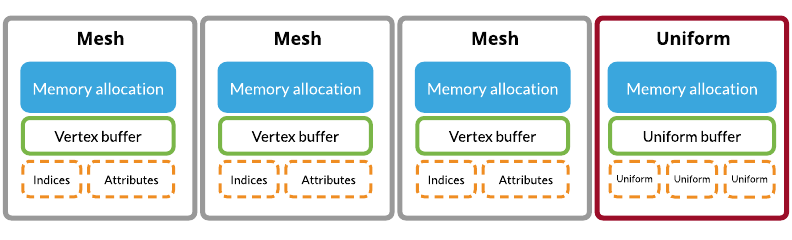

# TLVulkanRenderer
A simple Vulkan-based renderer for my [master thesis](https://docs.google.com/document/d/1YOAv2D23j74bExjP2MCMmDOQPquy9ywhBTW-tgU2QXA/edit?usp=sharing) on real-time transparency.

The renderer will be a rasterizer the implements [phenomenological transparency](http://graphics.cs.williams.edu/papers/TransparencyI3D16/McGuire2016Transparency.pdf) to demonstrate how the GPU could map well to this algorithm for real-time transparency.

This project also documents my learning progress with Vulkan and GPU programming.

# Releases

https://github.com/trungtle/TLVulkanRenderer/releases

# Updates

### Nov 4, 2016 - Memory & Depth Image

| Normal | Depth | Lambert |
|---|---|---|
||||

#### Memory management

In order to achieve cache ultilization and limit the amount of costly memory allocation, I packed the vertex indices and vertex attributes data for each mesh into the same `VkDeviceMemory` allocation and the same `VkBuffer`, and leaving the uniform buffer in its own `VkDeviceMemory` since it's being updated every frame. This helps reduce the initialization time to load each scene since we no longer have to create a new `VkBuffer` and allocate a new `VkDeviceMemoy` for each attribute.

In this layout scheme, we still need to partition based on each mesh data because when the meshes are extracted from glTF, each of them have their unique buffer view that needs to be handled properly. It seems to me that it's possible that we can just directly copy this glTF's buffer view into `VkDeviceMemory` and offset the `VkBuffer` correctly from there. It's also possibl to resuse the same `VkDeviceMemory` for different `VkBuffer`, but it seems quite error-prone to me to go down that path.  

More details can be found at [Vulkan Memory Management](https://developer.nvidia.com/vulkan-memory-management) from NVIDIA.

### Depth buffer

The depth buffer in Vulkan is represented using a [`VkImage`](https://www.khronos.org/registry/vulkan/specs/1.0/xhtml/vkspec.html#resources-images). It's a type of resource that the framebuffer uses to store its data. Similarly to the images inside the swapchain, I allocated a screen size depth image and attached it to the graphics pipeline. The depth/stentil stage can be enabled by the setting [VkPipelineDepthStencilStateCreateInfo](https://www.khronos.org/registry/vulkan/specs/1.0/xhtml/vkspec.html#VkPipelineDepthStencilStateCreateInfo) struct.

### Oct 21, 2016 - This time is for glTF!

[Duck](TLVulkanRenderer/scenes/Duck) mesh in glTF format (partially complete, shading hasn't been implemented properly)! 

Right now I was able to load the index data and vertex data. I'm working on merging all the vertex buffers required for position, normal, texcoord attributes, indices, and uniforms, into a single buffer or memory allocation as recommended in the [Vulkan Memory Management](https://developer.nvidia.com/vulkan-memory-management) blog by Chris Hebert ([@chrisjebert1973](https://github.com/chrisjebert1973)) and Christoph Kubisch.

### Oct 14, 2016 - Triangles!

Finished base rasterizer code to render a triangle.

# Requirements

- Build using x64 Visual Studio 2015 on Windows with a [Vulkan](https://www.khronos.org/vulkan/) support graphics card (Most discrete GPU in the last couple years should have Vulkan support). You can also check [NVIDIA support](https://developer.nvidia.com/vulkan-driver).
- [glfw 3.2.1](http://www.glfw.org/)
- [glm](http://glm.g-truc.net/0.9.8/index.html) library by [G-Truc Creation](http://www.g-truc.net/)
- [VulkanSDK](https://lunarg.com/vulkan-sdk/) by [LunarG](https://vulkan.lunarg.com/)
- Addthe following paths in Visual Studio project settings (for All Configurations):
 - C/C++ -> General -> Additional Include Directories:
    - `PATH_TO_PROJECT\TLVulkanRenderer\thirdparty`
    - `PATH_TO_GLFW\glfw\include`
    - `PATH_TO_VULKAN_SDK\VulkanSDK\1.0.26.0\Include`
    - `PATH_TO_GLM\glm`
 - Linker -> General -> Additional Library Directories:
    - `PATH_TO_VULKAN_SDK\VulkanSDK\1.0.26.0\Bin`
    - `PATH_TO_GLM\glfw-3.2.1.bin.WIN64\lib-vc2015`
 - Linker -> Input -> Additional Dependencies:
    - `vulkan-1.lib`
    - `glfw3.lib`

# Third party

 - [tinygltfloader](https://github.com/syoyo/tinygltfloader) by [@soyoyo](https://github.com/syoyo)
 - [obj2gltf](https://github.com/AnalyticalGraphicsInc/OBJ2GLTF) by [AnalyticalGraphicsInc](https://github.com/AnalyticalGraphicsInc)
 - [spdlog](https://github.com/gabime/spdlog) by [gabime](https://github.com/gabime/) (see LICENSE for details on LICENSE)

### References

Majority of this application was modified from:

  - [Vulkan Tutorial](https://vulkan-tutorial.com/) by Alexander Overvoorde. [Github](https://github.com/Overv/VulkanTutorial). 
  - WSI Tutorial by Chris Hebert
  - [Vulkan Samples](https://github.com/SaschaWillems/Vulkan) by Sascha Willems
  - [Vulkan Whitepaper](https://www.kdab.com/wp-content/uploads/stories/KDAB-whitepaper-Vulkan-2016-01-v4.pdf)
  - [Vulkan 1.0.28 - A Specification](https://www.khronos.org/registry/vulkan/specs/1.0-wsi_extensions/pdf/vkspec.pdf)

 ### Models

* [glTF Sample Models](https://github.com/KhronosGroup/glTF/blob/master/sampleModels/README.md)
* [octocat]() by [Sally Kong](https://sketchfab.com/models/cad2ffa5d8a24423ab246ee0916a7f3e). Model is converted using [obj2gltf](https://github.com/AnalyticalGraphicsInc/OBJ2GLTF).
* [wolf]() by [Rachel Hwang](https://www.linkedin.com/in/rachel-hwang-84a3b989). Model is converted using [obj2gltf](https://github.com/AnalyticalGraphicsInc/OBJ2GLTF).
* [centaur model](http://tf3dm.com/3d-model/free-base-mesh-centaur--67384.html) by [BAQStudio](http://tf3dm.com/user/baqstudio), Model is converted using [obj2gltf](https://github.com/AnalyticalGraphicsInc/OBJ2GLTF).
* Infinite, [3D Head Scan]() by Lee Perry-Smith is licensed under a Creative Commons Attribution 3.0 Unported License. Based on a work at www.triplegangers.com. This distribution was created by Morgan McGuire and Guedis Cardenas http://graphics.cs.williams.edu/data/. See [LICENSE](/gltfs/head/Infinite-Scan_License.txt). Model is converted using [obj2gltf](https://github.com/AnalyticalGraphicsInc/OBJ2GLTF).

